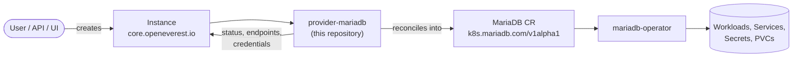

# MariaDB Provider

> [!WARNING]
> **Pre-alpha.** OpenEverest v2 and this provider are under active development. CRD schemas,
> chart values and defaults change frequently, including in breaking ways, and there is no
> supported upgrade path between versions yet. Not for production use.

<!-- Remove the pre-alpha banner and the status badge at v2 GA. -->

[](https://github.com/openeverest/openeverest)
[](https://github.com/openeverest/provider-mariadb/actions/workflows/ci.yaml)
[](https://github.com/openeverest/provider-mariadb/releases)
[](https://pkg.go.dev/github.com/openeverest/provider-mariadb)
[](LICENSE)

Run **MariaDB** on Kubernetes through [OpenEverest](https://github.com/openeverest/openeverest),
backed by the [`mariadb-operator`](https://github.com/mariadb-operator/mariadb-operator).

## What this is

OpenEverest providers translate a single, technology-agnostic `Instance` custom
resource into the native custom resources of an upstream Kubernetes operator —
for databases, but equally for caches, message queues, object storage, or
model-serving runtimes. This repository is the provider for **MariaDB**: it owns
the technology-specific knowledge — topologies, versions, parameters, backup
wiring — so that users, the API server, and the UI stay technology-agnostic.

> [!IMPORTANT]
> **This provider is not standalone.** It requires an OpenEverest installation
> (core CRDs and controller) in the cluster. Installing this chart on its own
> does nothing. See [Install OpenEverest](https://openeverest.io/documentation/current/quick-install.html).



The provider watches `Instance` resources whose `spec.providerRef.name` is
`mariadb`, and reports workload health back onto `Instance.status`. It never
manages pods directly — all lifecycle work is delegated to the operator.

## Compatibility

| provider-mariadb | OpenEverest | mariadb-operator | Kubernetes |
|---|---|---|---|
| `0.1.x` | `>= 2.0.0` | `26.6.x` | `1.30` – `1.34` |

## Capabilities

What you can do to a running instance through the `Instance` API. Upgrading the
provider itself is covered under [Installation](#installation).

| Capability | Status | Notes |
|---|---|---|
| Provisioning | ✅ | |
| Horizontal scaling | ✅ | `spec.components.engine.replicas` |
| Vertical scaling (CPU / memory) | ✅ | `spec.components.engine.resources` |
| Version upgrades | ✅ | of the deployed MariaDB version — change `spec.version`; see [Versions](#versions) |
| High availability (Galera) | ✅ | `spec.topology.type: galera` — multi-master cluster; odd node count (default 3) |
| Custom configuration | ✅ | `my.cnf` via the engine component's `configuration` parameter |
| Monitoring | ✅ | opt-in via the `monitoring` component; deploys `mysqld-exporter` and a Prometheus `ServiceMonitor` — requires the `ServiceMonitor` CRD (`monitoring.coreos.com`) |
| Pod scheduling (affinity) | ✅ | `spec.components.engine.affinity` — `nodeAffinity` and `podAntiAffinity` are mapped to the operator; `podAffinity` is rejected |
| TLS | ❌ | disabled by the provider; connections use username/password |

Stateful workloads additionally report:

| Capability | Status | Notes |
|---|---|---|
| Persistent storage | ✅ | `spec.components.engine.storage.size` |
| Storage expansion | ✅ | when the StorageClass allows volume expansion |
| Backups (on demand) | ❌ | planned |
| Backups (scheduled) | ❌ | planned |
| Point-in-time recovery | ❌ | planned |
| Restore | ❌ | planned |

## Installation

The provider chart is published as an OCI artifact:

```bash
helm install provider-mariadb \
  oci://ghcr.io/openeverest/charts/provider-mariadb \
  --version 0.1.2 \
  --namespace everest-system
```

- The `mariadb-operator` (and its CRDs) is bundled as a chart dependency and is
  installed automatically.

Upgrade and uninstall:

```bash
helm upgrade provider-mariadb oci://ghcr.io/openeverest/charts/provider-mariadb --version 0.1.2
helm uninstall provider-mariadb --namespace everest-system
```

Uninstalling the chart does **not** delete running `Instance` resources or their data.

## Usage

Verify that the provider registered itself:

```bash
kubectl get providers.core.openeverest.io mariadb
```

Create an instance:

```yaml
apiVersion: core.openeverest.io/v1alpha1
kind: Instance
metadata:
  name: my-instance
spec:
  providerRef:
    name: mariadb
  components:
    engine:
      type: mariadb
      replicas: 1
      resources:
        requests:
          cpu: 500m
          memory: 2G
      storage:
        size: 10Gi
```

Component names are defined by this provider — see
[definition/provider.yaml](definition/provider.yaml). `spec.version` and
`spec.topology` are optional; the provider defaults apply. More examples live in
[examples/](examples/).

Watch it come up and read the connection details:

```bash
kubectl get instance my-instance -w
kubectl get instance my-instance -o jsonpath='{.status.connectionSecretRef.name}'
```

The credentials (host, port, username, password, uri) live in the connection
Secret named by `.status.connectionSecretRef.name`.

## Topologies

<!-- BEGIN GENERATED: topologies -->
| Topology | Default | Description |
|---|---|---|
| `standalone` | ✅ | Single MariaDB instance (no replication or Galera) |
| `galera` | | Multi-master Galera cluster for high availability (odd number of nodes, default 3) |
<!-- END GENERATED: topologies -->

## Versions

<!-- BEGIN GENERATED: versions -->
| Version bundle | Default | mariadb |
|---|---|---|
| `11.4` | ✅ | `11.4` |
| `11.8` | | `11.8` |
<!-- END GENERATED: versions -->

Source of truth: [definition/versions.yaml](definition/versions.yaml).

## Configuration

- **Chart values:** [charts/provider-mariadb/values.yaml](charts/provider-mariadb/values.yaml)
- **Instance parameters:** per-component and per-topology `parameters` schemas,
  defined under [definition/](definition/) and published on the `Provider`
  resource (`kubectl get provider mariadb -o yaml`). The API server and the UI
  validate user input against these schemas.

The main technology-specific knob is the engine's `configuration` parameter,
which is passed through to the MariaDB server as `my.cnf`.

## Development

Requires Go (see [go.mod](go.mod)), Docker, Helm, kubectl, and a Kubernetes
cluster you can reach. For local development we recommend [k3d](https://k3d.io) —
`make dev-up` creates the cluster for you.

```bash
make dev-up             # local k3d cluster + Tilt dev environment
make generate           # RBAC, provider spec, Helm chart sync
make run                # run the provider locally against the cluster
make test-unit
make test-integration   # chainsaw suites under test/integration/
make dev-down
```

To work against a cluster you already have — kind, GKE, a shared dev cluster —
skip `make dev-up` and point Tilt at it:

```bash
cp dev/.env.example dev/.env   # set K8S_CONTEXT, and DOCKER_REGISTRY_URL for a remote registry
tilt up -f dev/Tiltfile
```

`make help` lists every target. `make verify` fails when generated files are
stale — run `make generate` and commit the result.

The provider contract (`Validate` / `Sync` / `Status` / `Cleanup`), RBAC
markers, watches, code generation, and the backup/restore interfaces are
documented once for all providers in [PROVIDER_DEVELOPMENT.md](https://github.com/openeverest/provider-sdk/blob/main/PROVIDER_DEVELOPMENT.md).

### Layout

| Path | Purpose |
|---|---|
| `cmd/provider/` | Entry point |
| `internal/provider/` | `ProviderInterface` implementation, RBAC markers |
| `internal/common/` | Component name constants |
| `definition/` | Provider identity, component types, versions, topologies |
| `charts/provider-mariadb/` | Helm chart (`generated/` is produced by `make generate`) |
| `config/rbac/role.yaml` | Generated `ClusterRole` — do not edit |
| `test/integration/` | Chainsaw suites |
| `test/vars.sh` | Pinned operator and workload versions used by tests |
| `examples/` | Example `Instance` resources |
| `dev/` | Tilt dev environment, `.env` configuration, k3d cluster config |
| `.github/workflows/` | CI: lint, build, unit and integration tests, release |

### Testing

- **Unit tests** — `make test-unit`.
- **Integration tests** — chainsaw suites under [test/integration/](test/integration/).
  The `core/` suite provisions an instance and verifies connectivity end to end.
- **CI** — [.github/workflows/ci.yaml](.github/workflows/ci.yaml) runs lint,
  build, unit tests, generated-file verification, Helm lint, and each
  integration suite on every pull request.

## Troubleshooting

```bash
kubectl logs -n everest-system deploy/provider-mariadb -f
```

| Symptom | Where to look |
|---|---|
| `Instance` stuck in `Creating` | `kubectl describe instance <name>` conditions, then the provider logs |
| No `Provider` resource in the cluster | Is the chart installed? Check the provider deployment logs |
| `Instance` ignored entirely | `spec.providerRef.name` must be `mariadb` |
| MariaDB resource created but no pods | Inspect the `MariaDB` custom resource status — the failure is upstream in the operator |

## Contributing

Issues and pull requests are welcome. See
[PROVIDER_DEVELOPMENT.md](https://github.com/openeverest/provider-sdk/blob/main/PROVIDER_DEVELOPMENT.md)
and the [OpenEverest Code of Conduct](https://github.com/openeverest/openeverest/blob/main/CODE_OF_CONDUCT.md).

## Security

Report vulnerabilities per the [OpenEverest security policy](https://github.com/openeverest/openeverest/blob/main/SECURITY.md).
Please do not open public issues for security reports.

## License

Apache License 2.0 — see [LICENSE](LICENSE) for details.
