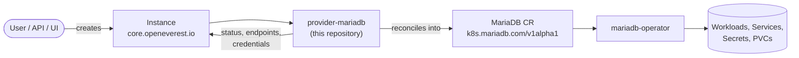

# MariaDB Provider

> [!WARNING]
> **Pre-alpha.** OpenEverest v2 and this provider are under active development. CRD schemas,
> chart values and defaults change frequently, including in breaking ways, and there is no
> supported upgrade path between versions yet. Not for production use.

<!-- Remove the pre-alpha banner and the status badge at v2 GA. -->

[](https://github.com/openeverest/openeverest)
[](https://github.com/openeverest/provider-mariadb/actions/workflows/ci.yaml)
[](https://github.com/openeverest/provider-mariadb/releases)
[](https://pkg.go.dev/github.com/openeverest/provider-mariadb)
[](LICENSE)

Run **MariaDB** on Kubernetes through [OpenEverest](https://github.com/openeverest/openeverest),
backed by the [`mariadb-operator`](https://github.com/mariadb-operator/mariadb-operator).

## What this is

OpenEverest providers translate a single, technology-agnostic `Instance` custom
resource into the native custom resources of an upstream Kubernetes operator —
for databases, but equally for caches, message queues, object storage, or
model-serving runtimes. This repository is the provider for **MariaDB**: it owns
the technology-specific knowledge — topologies, versions, parameters, backup
wiring — so that users, the API server, and the UI stay technology-agnostic.

> [!IMPORTANT]
> **This provider is not standalone.** It requires an OpenEverest installation
> (core CRDs and controller) in the cluster. Installing this chart on its own
> does nothing. See [Install OpenEverest](https://openeverest.io/documentation/current/quick-install.html).


```mermaid
flowchart LR
    U([User / API / UI]) -->|creates| I["Instance<br/>core.openeverest.io"]
    I --> P["provider-mariadb<br/>(this repository)"]
    P -->|reconciles into| O["MariaDB CR<br/>k8s.mariadb.com/v1alpha1"]
    O --> W["mariadb-operator"]
    W --> R[("Workloads, Services,<br/>Secrets, PVCs")]
    P -->|status, endpoints,<br/>credentials| I
```

The provider watches `Instance` resources whose `spec.providerRef.name` is
`mariadb`, and reports workload health back onto `Instance.status`. It never
manages pods directly — all lifecycle work is delegated to the operator.

## Compatibility

| provider-mariadb | OpenEverest | mariadb-operator | Kubernetes |
|---|---|---|---|
| `0.3.x` | `2.0.0-alpha.1` | `26.10.x` | `1.30` – `1.34` |
| `0.2.x` | `>= 2.0.0` | `26.10.x` | `1.30` – `1.34` |
| `0.1.x` | `>= 2.0.0` | `26.6.x` (≤ 0.1.5), `26.10.x` (≥ 0.1.6) | `1.30` – `1.34` |

## Capabilities

What you can do to a running instance through the `Instance` API. Upgrading the
provider itself is covered under [Installation](#installation).

| Capability | Status | Notes |
|---|---|---|
| Provisioning | ✅ | |
| Horizontal scaling | ✅ | `spec.components.engine.replicas`; scaling out the `replication` topology requires a backup storage in `spec.backup`, used to stage the physical backup that seeds new replicas |
| Vertical scaling (CPU / memory) | ✅ | `spec.components.engine.resources` |
| Version upgrades | ✅ | of the deployed MariaDB version — change `spec.version`; see [Versions](#versions). Downgrades to an older major or minor version are rejected |
| High availability (Galera) | ✅ | `spec.topology.type: galera` — multi-master cluster; odd node count (default 3) |
| High availability (replication) | ✅ | `spec.topology.type: replication` — async primary/replica cluster; at least 2 nodes (default 3). With a backup storage in `spec.backup`, replicas that break are rebuilt automatically |
| Proxy / load balancing (MaxScale) | ✅ | opt-in via the `proxy` component on `galera` and `replication`; see [MaxScale proxy](#maxscale-proxy) |
| Custom configuration | ✅ | `my.cnf` via the engine component's `configuration` parameter |
| Monitoring | ✅ | any metrics backend through `mysqld-exporter`, via `spec.monitoring.destinations` — see [Monitoring](#monitoring) |
| Pod scheduling | ✅ | `spec.components.{engine,proxy}.schedulingPolicy` — `affinity` (`nodeAffinity` and `podAntiAffinity`; `podAffinity` is rejected), `nodeSelector`, `tolerations` and `topologySpreadConstraints`; `schedulerName` is not supported. A set `affinity` replaces the HA default soft anti-affinity, `{}` sets none |
| TLS | ✅ | `spec.parameters.tls`: on by default; certificates from the operator's CA, a cert-manager issuer or your own Secret; CA published in the connection Secret |

Stateful workloads additionally report:

| Capability | Status | Notes |
|---|---|---|
| Persistent storage | ✅ | `spec.components.engine.storage.size` |
| Storage expansion | ✅ | when the StorageClass allows volume expansion; shrinking the volume or changing its StorageClass is rejected |
| Backups (on demand) | ✅ | logical (`mariadb-dump`) or physical (`mariadb-backup`) to S3-compatible storage; strategy selected via the backup `type` parameter |
| Backups (scheduled) | ✅ | cron schedules per storage via `spec.backup` |
| Restore | ✅ | logical backups are restored in place (same Instance only) or into a new Instance via `spec.dataSource`; physical backups are restored by seeding a new Instance from `spec.dataSource` |
| Point-in-time recovery | ✅ | binary log archival on the `replication` topology; one storage may enable `pitr`; recover a new `replication` Instance to a target time via `spec.dataSource` (`PointInTime`) |
| Start from a VolumeSnapshot | ✅ | `bootstrap.volumeSnapshot.name`: a new Instance from a snapshot of another instance's data volume, in seconds on copy-on-write storage; see [Start from a volume snapshot](#start-from-a-volume-snapshot) |

## Installation

The provider chart is published as an OCI artifact:

```bash
helm install provider-mariadb \
  oci://ghcr.io/openeverest/charts/provider-mariadb \
  --version 0.3.1 \
  --namespace everest-system
```

- The `mariadb-operator` (and its CRDs) is bundled as a chart dependency and is
  installed automatically.
- The chart registers an admission webhook, so an invalid `Instance` is rejected
  when it is written, with every error and its field path. Its serving certificate
  is generated by the chart and kept across upgrades; set
  `admission.certManager.enabled=true` to have cert-manager issue it, or supply one
  through `admission.certs`. If the provider is down, writes are admitted and the
  `Instance` reports the errors in its `Ready` condition. A missing object the
  `Instance` names, such as its user Secret, is never a reason to reject it:
  `kubectl` prints a warning, and the `Instance` reports it once created.

Upgrade and uninstall:

```bash
helm upgrade provider-mariadb oci://ghcr.io/openeverest/charts/provider-mariadb --version 0.3.1
helm uninstall provider-mariadb --namespace everest-system
```

Uninstalling the chart does **not** delete running `Instance` resources or their data.

### What an upgrade restarts

Upgrading the chart never restarts running database pods on its own. When the
bundled mariadb-operator is newer than the sidecars (agent and init containers)
running next to a Galera or replication cluster, updating them is a rolling
restart, so the provider holds it as maintenance on each `Instance`:

```bash
kubectl get instance my-db -o jsonpath='{.status.pendingMaintenance}'
# [{"approvalToken":"update-data-plane-to-26.10.2","severity":"RollingRestart",...}]
kubectl patch instance my-db --type merge \
  -p '{"spec":{"maintenance":{"approved":"update-data-plane-to-26.10.2"}}}'
```

Set `spec.maintenance.autoApproveUpTo: RollingRestart` to let such updates run
without approval. Standalone instances have no sidecars and are never held.

A pre-upgrade hook checks every `Instance` before the chart is upgraded. It
fails the upgrade when a cluster's sidecars are older than the new operator
supports — approve the pending update and wait for it to finish, then retry —
and warns about maintenance still waiting for approval.

## Usage

Verify that the provider registered itself:

```bash
kubectl get providers.core.openeverest.io mariadb
```

Create an instance:

```yaml
apiVersion: core.openeverest.io/v1alpha1
kind: Instance
metadata:
  name: my-instance
spec:
  providerRef:
    name: mariadb
  components:
    engine:
      type: mariadb
      replicas: 1
      resources:
        requests:
          cpu: 500m
          memory: 2G
      storage:
        size: 10Gi
```

Component names are defined by this provider — see
[definition/provider.yaml](definition/provider.yaml). `spec.version` and
`spec.topology` are optional; the provider defaults apply. More examples live in
[examples/](examples/).

Watch it come up and read the connection details:

```bash
kubectl get instance my-instance -w
kubectl get instance my-instance -o jsonpath='{.status.connectionSecretRef.name}'
```

The credentials (host, port, username, password, uri) live in the connection
Secret named by `.status.connectionSecretRef.name`.

The same Secret also carries an admin connection for tools that need
server-level privileges, such as migrations that set up replication:

| Key | Value |
| --- | --- |
| `admin-username`, `admin-password` | `root` and its password |
| `admin-host`, `admin-port` | the MariaDB Service (the primary Service for `galera` and `replication`), never MaxScale, which rejects `root` |
| `admin-tls`, `admin-ca.crt` | present when MariaDB has TLS enabled; the CA of the MariaDB server certificate |
| `admin-skip-replica-start` | `"true"` for `standalone` and `galera`: replication connections stay stopped when the server starts (see below) |

Applications should keep using `username`/`password`, which only have access
to the initial `everest` database. Anyone who can read the connection details
gets `root`.

`standalone` and `galera` servers run with `skip-slave-start`, appended after
the user's `configuration`. MariaDB does not persist a replication
connection's filters, so a connection started on boot would apply everything
its source writes, account changes included, before a tool such as a
migration could restore its filters. Neither topology uses replication
connections otherwise; the `replication` topology keeps the default, because
the operator does not restart replicas' replication after a Pod restart. A
replication connection you create yourself on these topologies must be
started again (`START SLAVE`) after a restart.

### TLS

TLS is configured for the whole instance under `spec.parameters.tls`, with
the shape every OpenEverest provider shares:

```yaml
spec:
  parameters:
    tls:
      mode: requireTLS            # disabled | preferTLS (default) | requireTLS
      issuer:                     # optional: a cert-manager issuer signs the server certificate
        name: company-ca
        kind: ClusterIssuer       # Issuer (default) or ClusterIssuer; any kind with group
        # group: awspca.cert-manager.io
      additionalNames:            # optional: extra DNS names for the certificate
        - mariadb.example.com
      # certificateSecretName: my-db-tls   # or: your own certificate, instead of issuer
      galeraSSTEnabled: true      # galera only; on by default
```

| Field | Meaning |
| --- | --- |
| `mode` | `preferTLS` (default) serves TLS and still accepts unencrypted clients; `requireTLS` rejects them (`require_secure_transport`) at MariaDB and at MaxScale; `disabled` turns TLS off, and can only be set when the instance is created. Changing the mode restarts the pods one at a time. |
| `certificateSecretName` | A Secret in the instance namespace with the server certificate and any intermediate CA certificates (`tls.crt`), its key (`tls.key`) and the CA certificate (`ca.crt`). Doesn't need cert-manager. |
| `issuer` | A cert-manager issuer that signs the server certificate; the operator requests it as the Certificate `<name>-server-cert` and cert-manager renews it. The issuer must write its CA certificate to `ca.crt`, as the CA and Vault issuers do (ACME issuers don't). |
| `additionalNames` | DNS names (no IP addresses) the certificate is valid for besides the instance's Services and pods. Used with `issuer` or the operator's CA, not with `certificateSecretName`. |
| `galeraSSTEnabled` | Encrypt Galera state snapshot transfers. Defaults to on for `galera` with TLS on; ignored on the other topologies. |

The server certificate comes, in order of precedence, from
`certificateSecretName`, `issuer`, or else a CA the mariadb-operator creates
for the instance. Client certificates (replication, Galera SST, MaxScale)
always come from the operator's CA.

- TLS can be turned on later, but not off once it is on.
- `certificateSecretName` and `issuer` are chosen when TLS is turned on and
  can't change while it is on: replicas and clients trust the CA of the
  certificate.
- Changing `additionalNames` reissues the certificate and restarts the pods,
  so on a running instance it waits for maintenance approval: the change shows
  in `status.pendingMaintenance` with a `tls-names-…` token, applied once you
  set it in `spec.maintenance.approved` (or with
  `spec.maintenance.autoApproveUpTo: RollingRestart`).
- The mariadb-operator restarts the pods, one at a time, whenever the server
  certificate changes, including when cert-manager renews it or you update
  your Secret.

The connection Secret contains `tls: "true"` and, under `ca.crt`, the CA bundle
clients verify the server with: the CA of the server certificate plus the
operator's CA. Connect with `--ssl-verify-server-cert` (`sslMode=VERIFY_IDENTITY`)
to the `host` it publishes.

#### Bring your own CA

With a cert-manager issuer for your company CA, set `issuer`; see
[examples/instance-tls.yaml](examples/instance-tls.yaml). Without
cert-manager, put the certificate in a Secret and set `certificateSecretName`:

```sh
kubectl create secret generic my-db-tls -n <namespace> \
  --from-file=tls.crt=server-chain.pem --from-file=tls.key=server-key.pem \
  --from-file=ca.crt=company-ca.pem
```

The operator, its probes and the replicas verify the certificate by name, so
it must be valid for:

- `<svc>.<namespace>.svc.cluster.local` and `<svc>.<namespace>.svc`, where
  `<svc>` is `<name>` for `standalone` and `<name>-primary` for `galera` and
  `replication`;
- for `galera` and `replication`, the pods:
  `*.<name>-internal.<namespace>.svc.cluster.local`;
- `localhost`, which the operator's probes connect to;
- any other name clients connect to.

The provider checks the Secret (keys, key pair, that `ca.crt` verifies the
certificate for server authentication, and the names above) and reports a
problem on the Instance. Updating the Secret rolls the new certificate out.

#### Migrating from the engine parameters

Earlier releases configured TLS under
`spec.components.engine.parameters.tls`. Those fields are gone, and an
Instance that still sets them fails validation until it is migrated:

| Before | After |
| --- | --- |
| `tls.enabled: false` | `spec.parameters.tls.mode: disabled` |
| `tls.enabled: true` (or unset), `tls.required: false` (or unset) | `mode: preferTLS` (or nothing) |
| `tls.required: true` | `mode: requireTLS` |
| `tls.galeraSSTEnabled` | `spec.parameters.tls.galeraSSTEnabled` |

For example, for an instance that required TLS:

```sh
kubectl patch instance <name> -n <namespace> --type=json -p '[
  {"op": "remove", "path": "/spec/components/engine/parameters/tls"},
  {"op": "add", "path": "/spec/parameters", "value": {"tls": {"mode": "requireTLS"}}}
]'
```

(Use `"op": "add", "path": "/spec/parameters/tls"` when the Instance already
has `spec.parameters`.) The MariaDB keeps running unchanged through the
migration.

### Status

The provider reports what it observes, and OpenEverest derives the `Instance`
conditions from it the same way for every provider. `status.phase` is
`Pending` until the database has first been available, `Provisioned` after
that, and `Terminating` once deletion is requested; the conditions carry the
rest.

| Condition | What this provider reports |
|---|---|
| `Available` | `True` while clients can connect. Galera needs a ready node; `standalone` and `replication` need their primary pod (`status.currentPrimary` on the `MariaDB`) to be ready, so a replication cluster stays available while a replica restarts. With the MaxScale proxy, a MaxScale pod must be ready too, and the initial user, whose credentials are the connection details, must exist with its grant: the operator creates them only after the `MariaDB` is ready. `Unknown` when the operator has not reported a primary, `False` while a restore runs or a new `Instance` is seeded. The reason names the cause, for example `NoPrimary`. |
| `Ready` | `True` once the database runs what the `Instance` asks for: the operator reports the `MariaDB` ready, its StatefulSet carries the latest image, resources and replica count from the `MariaDB` and has rolled out, and the MaxScale proxy, if any, is ready. Until then the message says what is being waited for, in the operator's words where it has any. |
| `Restoring` | `True` while a `Restore` of the `Instance` runs, and while a new `Instance` is seeded from `spec.dataSource`. |
| `Upgrading` | `True` while a MariaDB pod runs another image than the `MariaDB` asks for, which is how an engine version change rolls out. |
| `StorageResizing` | `True` while the operator resizes the data volumes. |

The connection details Secret is written the first time the database is
available, and kept current while a change rolls out.

Each component reports `desiredReplicas`, the pods it will have once the
database runs the `Instance`'s current spec, defaults included: `engine`, and
`proxy` when MaxScale is enabled.

A problem makes the `Instance` not `Ready`, with a reason that says what is
wrong. Problems come from the reason of the operator's `Ready` condition on
the `MariaDB`:

| Reason | Cause |
|---|---|
| `SuspendedOutsideOpenEverest` | `spec.suspend` is set on the `MariaDB`, so the operator applies no changes. Only unsetting it there resumes them. |
| `InitializationFailed` | The operator could not initialize the database. |
| `ScaleOutFailed` | Adding a replica failed. |
| `ReplicaRecoveryFailed` | Recovering a broken replica failed. |
| `BinlogArchivingFailed` | Archiving binary logs for point-in-time recovery failed. |
| `BinlogReplayFailed` | Replaying binary logs during a point-in-time recovery failed. |
| `EngineError` | Any other error the operator reports; the message quotes it. |

A write the operator made from a stale read is not a problem: the operator
retries it at once. Pods that crash or cannot be scheduled are reported by
OpenEverest from the pods themselves.

Limits of what the provider can know:

- The operator does not record which generation of the `MariaDB` its `Ready`
  condition is about. The provider compares the fields the operator copies to
  the StatefulSet (image, resources, replicas) instead, so a change to any
  other field can read as `Ready` for the moment before the operator acts on
  it.
- An operator error is never terminal, because the operator does not say
  which generation it is about: right after a fix, the error still showing
  may be the one being fixed.
- Availability is read from pod readiness, as fresh as the last pod event the
  provider has seen.

## Monitoring

Monitoring is configured through `MonitoringDestination`s: each entry of
`spec.monitoring.destinations` sends the instance's monitoring data to one
destination.

```yaml
spec:
  monitoring:
    destinations:
      - name: prometheus
        destinationRef:
          name: prometheus
```

The provider declares its monitoring contract in
[definition/monitoring.yaml](definition/monitoring.yaml): a `mysqld-exporter`
metrics endpoint for the `mariadb` component type, whose kind (`mariadb`, the
name monitoring classes match on) is declared in
[definition/provider.yaml](definition/provider.yaml). It renders no
operator-native integration such as PMM.

- **Metrics backends** (for example the `prometheus` and `victoriametrics`
  classes) turn on the operator's `mysqld-exporter` (`spec.metrics`) while one
  of the instance's destinations requires metrics. The exporter runs as a
  separate Deployment (`<name>-metrics`), so the MariaDB pods are not
  restarted, and logs in as a metrics user the operator creates. Its image is
  pinned by the `mysqld-exporter` component type in
  [definition/versions.yaml](definition/versions.yaml).
- While the exporter runs, the provider publishes one endpoint per MariaDB pod
  in `status.monitoring.sources`: the exporter's `/probe` on the
  `metrics` port with the pod as `target`, which the class's extension turns
  into the `instance` label when it creates the scrape resources. The
  operator's own `ServiceMonitor` stays off.
- Once no destination requires metrics, the provider deletes the exporter
  Deployment, which the operator leaves behind.

To scrape the exporter with a tool OpenEverest does not configure (a Datadog
agent, Grafana Alloy, a hand-written `PodMonitor`), set the metrics policy to
`Always`. The exporter then runs without any destination, and its endpoints
are published in `status.monitoring.sources.metrics`:

```yaml
spec:
  monitoring:
    sources:
      metrics:
        policy: Always   # OnDemand (default) | Always
```

`kubectl get monitoringbindings` lists one binding per destination entry, and
the instance's `MonitoringConfigured` condition reports whether every entry is
configured. See [examples/instance-monitoring.yaml](examples/instance-monitoring.yaml).

> [!NOTE]
> Up to `0.2.x`, metrics were configured through a `monitoring` component. That
> component is gone: move to `spec.monitoring.destinations`. The provider
> deletes the `ServiceMonitor` and `VMServiceScrape` the earlier versions
> created.

## MaxScale proxy

The `galera` and `replication` topologies can be fronted by
[MariaDB MaxScale](https://github.com/mariadb-operator/mariadb-operator/blob/main/docs/maxscale.md),
which routes writes to the primary and balances reads across nodes. Enable it
through the `proxy` component:

```yaml
spec:
  topology:
    type: replication
  components:
    proxy:
      replicas: 2        # default
      parameters:
        enabled: true
      service:
        serviceType: LoadBalancer
```

While the proxy is enabled, the connection Secret points at the MaxScale
Service (`<name>-maxscale`) with the same credentials. MaxScale terminates TLS
only when the instance requires it (`spec.parameters.tls.mode: requireTLS`); the connection Secret
then carries the MaxScale CA. Setting `enabled: false` removes MaxScale. See
[examples/instance-maxscale.yaml](examples/instance-maxscale.yaml).

Primary failover, rejoin and `read_only` stay with the operator: MaxScale only
routes traffic and follows the topology. With `replication`, the provider turns
off MaxScale's own `auto_failover`, `auto_rejoin` and
`switchover_on_low_disk_space`, because running failover in both MaxScale and
the operator races and can leave no writable primary
([#37](https://github.com/openeverest/provider-mariadb/issues/37)).
Replication nodes also boot read-only, so a restarted former primary never
accepts writes before the operator has demoted it.

> [!IMPORTANT]
> MaxScale is licensed under the
> [Business Source License](https://github.com/mariadb-corporation/MaxScale/blob/23.08/LICENSE.TXT).
> Make sure you understand the implications before enabling it.

## Backups and restore

Backups are driven natively by the operator to an S3-compatible object store —
the provider never runs side-car Jobs. Two strategies are available, selected
per backup via the `type` parameter:

- **`logical`** — a `mariadb-dump` SQL dump, restored in place (from a backup of
  the same Instance) or by seeding a new Instance from `spec.dataSource`.
- **`physical`** — a `mariadb-backup` data-directory snapshot, restored by
  seeding a new Instance from `spec.dataSource` (in-place restore is not
  supported by the engine for physical backups).

Point-in-time recovery builds on physical backups plus binary log archival; see
[Point-in-time recovery](#point-in-time-recovery) below.

Enable backups on the Instance by registering a `BackupStorage` (a reference to
your object store) under `spec.backup`, using the provider's `mariadb`
`BackupClass`. Cron `schedules` are configured per storage:

```yaml
spec:
  backup:
    enabled: true
    classRef:
      name: mariadb
    storages:
      - storageRef:
          name: my-s3-storage
        schedules:
          - name: daily
            enabled: true
            cron: "0 0 * * *"
            retention:
              type: count   # or `type: time` with `duration: 30d` (d/w/m)
              count: 7
            parameters:
              type: physical
              compression: gzip
```

On-demand backups are taken by creating a `Backup` resource that targets the
same storage and class. Restore a new Instance from an existing backup (logical
or physical) with `spec.dataSource`:

```yaml
spec:
  dataSource:
    type: Backup
    backup:
      backupRef:
        name: my-backup
```

`spec.dataSource` is immutable once set and requires `spec.backup.enabled: true`
with at least one storage so the provider can read the source backup. The new
Instance reuses the source Instance's credentials, because the backup carries
its users. Its `Restoring` condition is `True` until the data is in place: physical
backups are restored before MariaDB starts, while logical backups are replayed
once the new cluster is up.

### Point-in-time recovery

Point-in-time recovery (PITR) continuously archives the primary's binary logs to
object storage on top of a full physical base backup, so an Instance can be
recovered to any moment within the retained window. Binary log archival is only
supported on the **`replication`** topology (Galera and standalone are not
supported by the engine yet).

Enable it by setting `pitr.enabled` on exactly one storage that also declares a
physical backup schedule (which drives the base backup); the provider reconciles
a `PointInTimeRecovery` object and turns on archival:

```yaml
spec:
  topology:
    type: replication
  backup:
    enabled: true
    classRef:
      name: mariadb
    storages:
      - storageRef:
          name: my-s3-storage
        pitr:
          enabled: true
        schedules:
          - name: base
            enabled: true
            cron: "0 * * * *"
            parameters:
              type: physical
```

The recovery window is published on `status.backup.storages[].pitr`. Recover a
new Instance to a target time (or the latest archived point) via
`spec.dataSource`:

```yaml
spec:
  dataSource:
    type: PointInTime
    pointInTime:
      source:
        instanceRef:
          name: my-source-instance
        storageRef:
          name: my-s3-storage
      recoveryTarget: date   # or "latest"
      date: 2026-02-20T18:00:04Z
  topology:
    type: replication
```

The recovered Instance must use the `replication` topology: the engine only
replays binary logs on replication clusters. The Instance reports `Restoring`
until the binary logs are replayed up to the target, and `Failed` if the replay
fails.

### Start from a volume snapshot

`bootstrap.volumeSnapshot.name` starts a new Instance from a VolumeSnapshot of
another instance's data volume, in the same namespace, instead of an empty
database. The operator creates every node's volume from the snapshot
(`bootstrapFrom.volumeSnapshotRef`) and InnoDB recovers it as after a crash, so
a snapshot of a running node is enough. On storage whose snapshots are
copy-on-write clones, such as OpenEBS ZFS LocalPV, it's ready in under a minute
whatever the size; the Branching plugin uses it to make instance branches.

```yaml
spec:
  topology:
    type: standalone
  components:
    engine:
      type: mariadb
      storage:
        size: 20Gi                  # the snapshot's size: some drivers can't resize clones
        storageClass: openebs-zfspv
      parameters:
        bootstrap:
          volumeSnapshot:
            name: orders-snapshot-1   # annotated bootstrap-instance: <this instance>
```

- The snapshot must be annotated
  `provider-mariadb.openeverest.io/bootstrap-instance: <instance name>`.
  Everest checks that a user may read an Instance's `spec.dataSource`, not its
  engine parameters: the annotation, which Everest users can't set, is what
  lets an Instance start from a snapshot. Without it the Instance is admitted
  with a warning and reports the error, and nothing is created.
- The data carries the source's users. The operator sets the new Instance's
  own password on its user (`everest`). Root's password is in the data too:
  the new Instance starts with the source's root password, copied from the
  instance whose volume was snapshotted, then the provider replaces it with
  a new one. A standalone node restarts once for that (its probes use the
  password it started with); the Instance stays `Provisioning` until it runs
  with the new password, so its connection details never carry the source's.
- The snapshot is only read at creation and can't be changed afterwards, nor
  combined with `spec.dataSource`.
- A snapshot of a replication replica carries its replication settings:
  reset them (`RESET REPLICA ALL`) on a standalone Instance made from it.

## Topologies

<!-- BEGIN GENERATED: topologies -->
| Topology | Default | Description |
|---|---|---|
| `standalone` | ✅ | Single MariaDB instance (no replication or Galera) |
| `galera` | | Multi-master Galera cluster for high availability (odd number of nodes, default 3) |
| `replication` | | Async primary/replica cluster for high availability (at least 2 nodes, default 3) |
<!-- END GENERATED: topologies -->

## Versions

<!-- BEGIN GENERATED: versions -->
| Version bundle | Default | mariadb |
|---|---|---|
| `10.11` | | `10.11` |
| `11.4` | | `11.4` |
| `11.8` | | `11.8` |
| `12.3` | ✅ | `12.3` |
<!-- END GENERATED: versions -->

Source of truth: [definition/versions.yaml](definition/versions.yaml).

## Configuration

- **Chart values:** [charts/provider-mariadb/values.yaml](charts/provider-mariadb/values.yaml)
- **Instance parameters:** per-component and per-topology `parameters` schemas,
  defined under [definition/](definition/) and published on the `Provider`
  resource (`kubectl get provider mariadb -o yaml`). The provider rejects an
  Instance that does not match them, and the UI checks the form against them as
  you type.

The main technology-specific knob is the engine's `configuration` parameter,
which is passed through to the MariaDB server as `my.cnf`.

## Development

Requires Go (see [go.mod](go.mod)), Docker, Helm, kubectl, and a Kubernetes
cluster you can reach. For local development we recommend [k3d](https://k3d.io) —
`make dev-up` creates the cluster for you.

```bash
make dev-up             # local k3d cluster + Tilt dev environment
make generate           # RBAC, provider spec, Helm chart sync
make run                # run the provider locally against the cluster
make test-unit
make test-integration   # chainsaw suites under test/integration/
make dev-down
```

To work against a cluster you already have — kind, GKE, a shared dev cluster —
skip `make dev-up` and point Tilt at it:

```bash
cp dev/.env.example dev/.env   # set K8S_CONTEXT, and DOCKER_REGISTRY_URL for a remote registry
tilt up -f dev/Tiltfile
```

`make help` lists every target. `make verify` fails when generated files are
stale — run `make generate` and commit the result.

The provider contract (`Validate` / `Sync` / `Status` / `Cleanup`), RBAC
markers, watches, code generation, and the backup/restore interfaces are
documented once for all providers in [PROVIDER_DEVELOPMENT.md](https://github.com/openeverest/provider-sdk/blob/main/PROVIDER_DEVELOPMENT.md).

### Disruptive changes

A change the provider makes to a running cluster that restarts its pods —
a sidecar update after an operator bump, a new default in the pod template —
must wait for maintenance approval: call `c.RequestMaintenance` with a token
that names the change and apply it only once that returns true, as
`approveDataPlaneUpdate` (`internal/provider/dataplane.go`) and
`approveAdditionalNames` (`internal/provider/tls.go`) do. New instances need no
approval.

When bumping the operator, read its upgrade guide. If it says the data plane
*must* be updated, raise `minDataPlaneVersion` in
`internal/provider/upgrade.go` to the release that requires it, so the
pre-upgrade check blocks upgrades from clusters still behind it.

### Layout

| Path | Purpose |
|---|---|
| `cmd/provider/` | Entry point |
| `internal/provider/` | `ProviderInterface` implementation, RBAC markers |
| `internal/common/` | Component name constants |
| `definition/` | Provider identity, component types, versions, topologies |
| `charts/provider-mariadb/` | Helm chart (`generated/` is produced by `make generate`) |
| `config/rbac/role.yaml` | Generated `ClusterRole` — do not edit |
| `test/integration/` | Chainsaw suites |
| `test/vars.sh` | Pinned operator and workload versions used by tests |
| `examples/` | Example `Instance` resources |
| `dev/` | Tilt dev environment, `.env` configuration, k3d cluster config |
| `.github/workflows/` | CI: lint, build, unit and integration tests, release |

### Testing

- **Unit tests** — `make test-unit`.
- **Integration tests** — chainsaw suites under [test/integration/](test/integration/).
  The `core/` suite provisions an instance and verifies connectivity end to end.
- **CI** — [.github/workflows/ci.yaml](.github/workflows/ci.yaml) runs lint,
  build, unit tests, generated-file verification, Helm lint, and each
  integration suite on every pull request.

## Troubleshooting

```bash
kubectl logs -n everest-system deploy/provider-mariadb -f
```

| Symptom | Where to look |
|---|---|
| `Instance` stuck in `Creating` | `kubectl describe instance <name>` conditions, then the provider logs |
| No `Provider` resource in the cluster | Is the chart installed? Check the provider deployment logs |
| `Instance` ignored entirely | `spec.providerRef.name` must be `mariadb` |
| MariaDB resource created but no pods | Inspect the `MariaDB` custom resource status — the failure is upstream in the operator |

## Contributing

Issues and pull requests are welcome. See
[PROVIDER_DEVELOPMENT.md](https://github.com/openeverest/provider-sdk/blob/main/PROVIDER_DEVELOPMENT.md)
and the [OpenEverest Code of Conduct](https://github.com/openeverest/openeverest/blob/main/CODE_OF_CONDUCT.md).

## Security

Report vulnerabilities per the [OpenEverest security policy](https://github.com/openeverest/openeverest/blob/main/SECURITY.md).
Please do not open public issues for security reports.

## License

Apache License 2.0 — see [LICENSE](LICENSE) for details.
